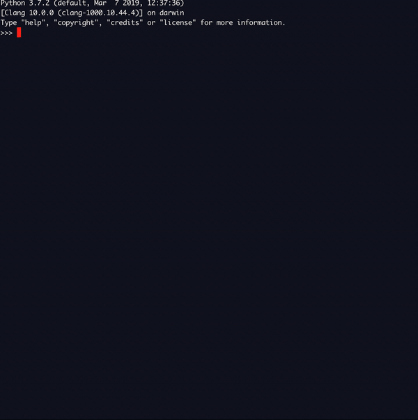

# 'dunder'.\_\_mifflin\_\_

This packages add `__mifflin__` to all python objects.

    import dunder_mifflin
    'dunder'.__mifflin__()

# License
Apache 2.0 - See [the LICENSE](LICENSE) for more information.

# Dependencies
This package has the following dependencies

- asciimatics, which handles reprinting over existing text on the screen (Apache)
- forbiddenfruit, which handles patching the built in types of Python (GPLv3)